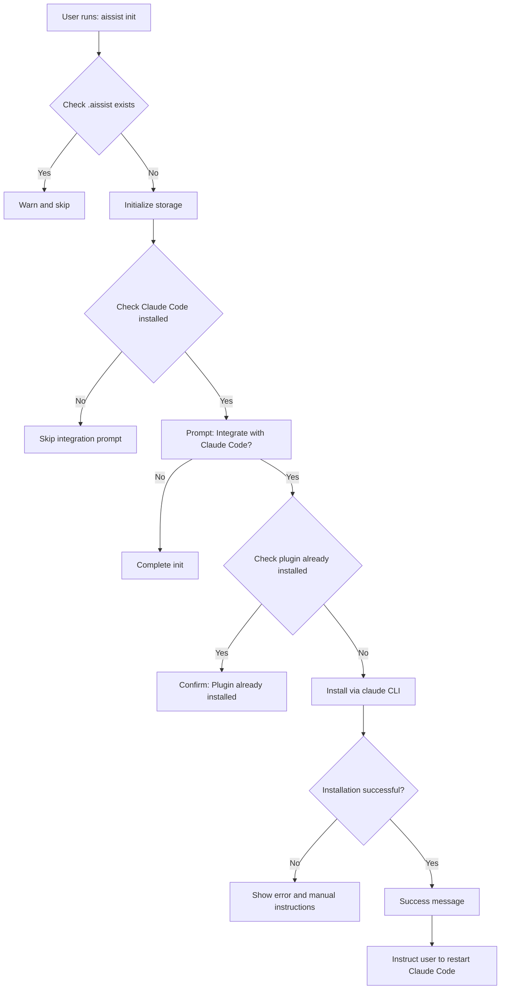

# Design: Integrate Claude Code Plugin

## Architecture Overview

This change introduces three major components:

1. **Plugin Infrastructure** - Package aissist as a Claude Code plugin
2. **Init Enhancement** - Extend init command to install plugin automatically
3. **History Import** - New log command to import GitHub activity

## Plugin Structure

```
aissist/
├── .claude-plugin/
│   ├── plugin.json           # Plugin metadata
│   └── marketplace.json      # Local marketplace (dev only)
├── plugin/
│   └── commands/
│       ├── log.md           # Log command slash command
│       ├── goal.md          # Goal management slash command
│       └── recall.md        # Recall slash command
├── src/                     # Existing CLI source
└── dist/                    # Built CLI (used by plugin commands)
```

### Plugin vs CLI Architecture

The plugin does NOT reimplement aissist functionality. Instead:
- Slash commands invoke the aissist CLI via subprocess
- Plugin commands act as thin wrappers with enhanced UX
- Core logic remains in TypeScript CLI codebase
- Plugin provides integration layer only

**Rationale**: This approach maintains a single source of truth, avoids code duplication, and ensures consistency between standalone CLI and plugin usage.

## Init Command Flow



### Claude Code Detection

The init command will detect Claude Code by:
1. Checking if `claude` CLI is in PATH
2. Verifying Claude Code is authenticated (`claude --version` succeeds)
3. Checking if plugin is already installed (via marketplace or plugin list)

If any check fails, gracefully skip with informative message.

### Plugin Installation Strategy

**Approach: Use Claude Code Plugin System** (SELECTED)

The init command will:
1. Add aissist as a local marketplace using the npm package path
2. Install the plugin using `claude` CLI commands programmatically
3. Verify installation success
4. Prompt user to restart Claude Code or run `/plugin refresh`

**Key Implementation Details**:
- Package aissist with `.claude-plugin/` directory structure
- Use local file path as marketplace during development: `file://<aissist-package-path>`
- For published version, users can add marketplace: `npm install -g aissist && aissist init`
- Plugin installation command: Execute `claude` CLI subprocess with proper args

**Advantages**:
- Uses official plugin installation mechanism
- Proper plugin lifecycle management
- Automatic command registration
- Works with Claude Code's plugin update system
- Enables future distribution via official marketplace

**Installation Methods Supported**:
1. **Local Development**: Use npm link or file path
2. **Global Install**: After npm install -g aissist
3. **Project Install**: Use node_modules path
4. **Manual**: User can run `/plugin marketplace add` and `/plugin install` themselves

## Log Command Design

### GitHub Integration

The log command will use GitHub's REST API to fetch:
- Commits authored by the user
- Pull requests opened by the user
- PR reviews and comments by the user (optional)

**Authentication**: Use existing `gh` CLI credentials or prompt for GitHub token.

### Date Parsing Strategy

Support natural language inputs via date-fns:
- "today" → current date
- "yesterday" → 1 day ago
- "this week" → Monday of current week to today
- "this month" → First day of current month to today
- "last week" → Previous Monday-Sunday
- "last month" → Entire previous month
- ISO dates → "2024-01-15"

**Implementation**: Use date-fns `parse` and `isValid` with fallback to prompting user.

### Semantic Summarization

GitHub commits often have terse messages. The log command will:
1. Fetch commit/PR data in batches
2. Group related commits by topic (using LLM summarization)
3. Generate semantic history entries (one per logical unit of work)
4. Write to dated history files

**Example**:
```
GitHub commits:
- "fix typo"
- "update docs"
- "add tests"

→ aissist history entry:
"Improved documentation and test coverage for authentication module"
```

### GitHub API Usage

```typescript
interface GitHubActivity {
  type: 'commit' | 'pr' | 'review';
  date: Date;
  message: string;
  url: string;
  repo: string;
}
```

**Rate Limiting**: GitHub API allows 5000 requests/hour for authenticated users. For safety:
- Batch requests per repository
- Cache responses during single session
- Show progress indicator with ETA
- Warn user if approaching limits

### Tool Permissions

The log slash command will require:
```yaml
allowed-tools:
  - Bash(git:*)
  - Bash(gh:*)
  - Bash(aissist history log:*)
```

This allows the command to:
- Check current repository context
- Fetch GitHub data via `gh` CLI
- Write history entries via aissist CLI

## Slash Commands Design

### Command: /aissist:log

```markdown
---
description: Import work history from GitHub
argument-hint: [timeframe]
allowed-tools: Bash(git:*), Bash(gh:*), Bash(aissist history log:*)
---

# Log GitHub Activity

Import your GitHub commits and pull requests as aissist history entries.

**Usage**: /aissist:log [timeframe]

**Examples**:
- /aissist:log today
- /aissist:log "this week"
- /aissist:log "2024-01-15"

You will be asked to specify a timeframe. The command will:
1. Fetch your GitHub activity using gh CLI
2. Semantically group related changes
3. Log entries to your aissist history

$ARGUMENTS
```

### Command: /aissist:recall

```markdown
---
description: Semantic search across your aissist memory
argument-hint: <query>
allowed-tools: Bash(aissist recall:*), Grep, Read, Glob
---

# Recall from Memory

Ask questions about your goals, history, reflections, and context.

**Usage**: /aissist:recall <query>

$ARGUMENTS
```

### Command: /aissist:goal

```markdown
---
description: Manage goals interactively
allowed-tools: Bash(aissist goal:*), Bash(aissist goal add:*), Bash(aissist goal list:*), Bash(aissist goal complete:*)
---

# Goal Management

Manage your goals through aissist.

**Usage**: /aissist:goal [subcommand]

$ARGUMENTS
```

## Data Flow

### Log Command Sequence

```
User → /aissist:log "this week"
  ↓
Claude Code executes log.md
  ↓
Bash: gh api /repos/{repo}/commits?author={user}&since={date}
  ↓
Bash: aissist history log "{semantic summary}" --date {date}
  ↓
History entries written to .aissist/history/YYYY-MM-DD.md
  ↓
Success feedback to user
```

### Init Command Sequence

```
User → aissist init
  ↓
Check .aissist exists → Create if needed
  ↓
Check claude CLI → Detect installation
  ↓
Prompt user → "Integrate with Claude Code?"
  ↓
Determine aissist package path (global or local)
  ↓
Execute: claude plugin marketplace add file://<package-path>
  ↓
Execute: claude plugin install aissist
  ↓
Verify installation → Check plugin list
  ↓
Display success → Instruct user to restart/refresh Claude Code
```

## Error Handling

### Graceful Degradation

- **No Claude Code**: Skip integration prompt, continue init
- **No .claude directory**: Warn user, provide manual setup instructions
- **No GitHub credentials**: Prompt for token, fallback to manual entry
- **GitHub API errors**: Retry with exponential backoff, then fail gracefully
- **Rate limiting**: Show clear message, suggest retrying later

### User Feedback

All operations should provide:
- Progress indicators (spinners for long operations)
- Clear error messages with actionable next steps
- Success confirmations with examples of what was created

## Security Considerations

- **GitHub Token**: Store in environment variable or use `gh` CLI's existing auth
- **File Permissions**: Respect existing .claude directory permissions
- **Tool Restrictions**: Slash commands limited to specific Bash commands (no arbitrary execution)
- **Input Validation**: Sanitize date inputs, validate GitHub API responses

## Performance Considerations

- **GitHub API**: Batch requests by repository to minimize round trips
- **Semantic Summarization**: Process commits in chunks (max 50 per batch)
- **File Writes**: Batch history entries by date to minimize I/O
- **Plugin Load Time**: Keep command files small (< 1KB each)

## Testing Strategy

### Unit Tests
- Date parsing logic (various natural language inputs)
- GitHub API response handling
- Semantic summarization grouping

### Integration Tests
- Init command with Claude Code detection
- Log command with mock GitHub API
- Plugin command execution via subprocess

### Manual Tests
- Install plugin in real Claude Code project
- Execute slash commands in various contexts
- Verify history entries are correctly formatted
- Test error scenarios (no auth, rate limits, etc.)

## Future Enhancements

Not in scope for this change, but worth considering:
- Support for GitLab/Bitbucket APIs
- Real-time commit watching (daemon mode)
- Bi-directional sync (export aissist → GitHub issues)
- Plugin marketplace distribution
- MCP server integration for deeper Claude Code access
